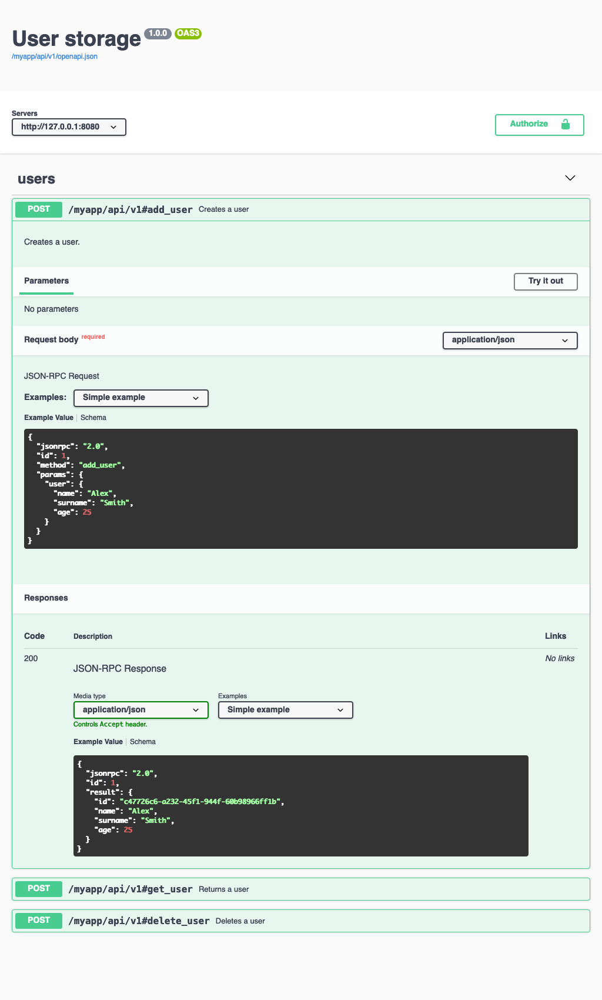
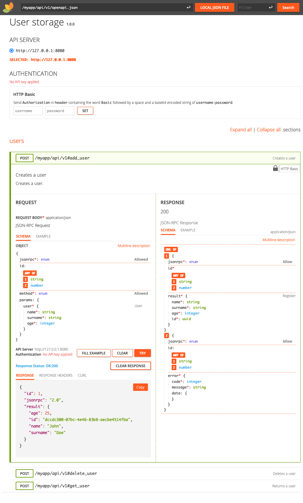
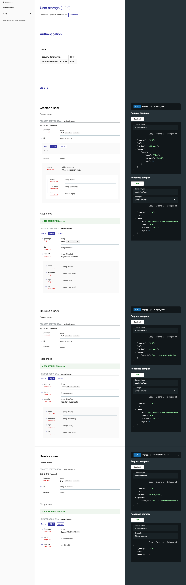

.. _quickstart:

Quick start
===========

Client requests
_______________

``pjrpc`` client interface is very simple and intuitive. Methods may be called by name, using proxy object
or by sending handmade :py:class:`pjrpc.common.Request` class object. Notification requests can be made using
:py:meth:`pjrpc.client.AbstractClient.notify` method or by sending a :py:class:`pjrpc.common.Request` object without id.

.. code-block:: python

    import pjrpc
    from pjrpc.client.backend import requests as pjrpc_client

    client = pjrpc_client.Client('http://localhost/api/v1')

    response: pjrpc.Response = client.send(pjrpc.Request('sum', params=[1, 2], id=1))
    print(f"1 + 2 = {response.result}")

    result = client('sum', a=1, b=2)
    print(f"1 + 2 = {result}")

    result = client.proxy.sum(1, 2)
    print(f"1 + 2 = {result}")

    client.notify('tick')

Asynchronous client api looks pretty much the same:

.. code-block:: python

    import pjrpc
    from pjrpc.client.backend import aiohttp as pjrpc_client

    client = pjrpc_client.Client('http://localhost/api/v1')

    response = await client.send(pjrpc.Request('sum', params=[1, 2], id=1))
    print(f"1 + 2 = {response.result}")

    result = await client('sum', a=1, b=2)
    print(f"1 + 2 = {result}")

    result = await client.proxy.sum(1, 2)
    print(f"1 + 2 = {result}")

    await client.notify('tick')

Batch requests
______________

Batch requests also supported. You can build :py:class:`pjrpc.common.BatchRequest` request by your hand and then send
it to the server. The result is a :py:class:`pjrpc.common.BatchResponse` instance you can iterate over to get all
the results or get each one by index:

.. code-block:: python

    import pjrpc
    from pjrpc.client.backend import requests as pjrpc_client

    client = pjrpc_client.Client('http://localhost/api/v1')

    batch_response = await client.batch.send(pjrpc.BatchRequest(
        pjrpc.Request('sum', [2, 2], id=1),
        pjrpc.Request('sub', [2, 2], id=2),
        pjrpc.Request('div', [2, 2], id=3),
        pjrpc.Request('mult', [2, 2], id=4),
    ))
    print(f"2 + 2 = {batch_response[0].result}")
    print(f"2 - 2 = {batch_response[1].result}")
    print(f"2 / 2 = {batch_response[2].result}")
    print(f"2 * 2 = {batch_response[3].result}")

There are also several alternative approaches which are a syntactic sugar for the first one (note that the result
is not a :py:class:`pjrpc.common.BatchResponse` object anymore but a tuple of "plain" method invocation results):

- using chain call notation:

.. code-block:: python

    result = await client.batch('sum', 2, 2)('sub', 2, 2)('div', 2, 2)('mult', 2, 2).call()
    print(f"2 + 2 = {result[0]}")
    print(f"2 - 2 = {result[1]}")
    print(f"2 / 2 = {result[2]}")
    print(f"2 * 2 = {result[3]}")

- using subscription operator:

.. code-block:: python

    result = await client.batch[
        ('sum', 2, 2),
        ('sub', 2, 2),
        ('div', 2, 2),
        ('mult', 2, 2),
    ]
    print(f"2 + 2 = {result[0]}")
    print(f"2 - 2 = {result[1]}")
    print(f"2 / 2 = {result[2]}")
    print(f"2 * 2 = {result[3]}")

- using proxy chain call:

.. code-block:: python

    result = await client.batch.proxy.sum(2, 2).sub(2, 2).div(2, 2).mult(2, 2).call()
    print(f"2 + 2 = {result[0]}")
    print(f"2 - 2 = {result[1]}")
    print(f"2 / 2 = {result[2]}")
    print(f"2 * 2 = {result[3]}")

Which one to use is up to you but be aware that if any of the requests returns an error the result of the other ones
will be lost. In such case the first approach can be used to iterate over all the responses and get the results of
the succeeded ones like this:

.. code-block:: python

    import pjrpc
    from pjrpc.client.backend import requests as pjrpc_client

    client = pjrpc_client.Client('http://localhost/api/v1')

    batch_response = client.batch.send(pjrpc.BatchRequest(
        pjrpc.Request('sum', [2, 2], id=1),
        pjrpc.Request('sub', [2, 2], id=2),
        pjrpc.Request('div', [2, 2], id=3),
        pjrpc.Request('mult', [2, 2], id=4),
    ))

    for response in batch_response:
        if response.is_success:
            print(response.result)
        else:
            print(response.error)

Batch notifications:

.. code-block:: python

    import pjrpc
    from pjrpc.client.backend import requests as pjrpc_client

    client = pjrpc_client.Client('http://localhost/api/v1')

    client.batch.notify('tick').notify('tack').notify('tick').notify('tack').call()

Server
______

``pjrpc`` supports popular backend frameworks like `aiohttp <https://aiohttp.readthedocs.io>`_,
`flask <https://flask.palletsprojects.com>`_ and message brokers like `kombu <https://kombu.readthedocs.io/en/stable/>`_
and `aio_pika <https://aio-pika.readthedocs.io>`_.

Running of aiohttp based JSON-RPC server is a very simple process. Just define methods, add them to the
registry and run the server:

.. code-block:: python

    import uuid

    from aiohttp import web

    import pjrpc.server
    from pjrpc.server.integration import aiohttp

    methods = pjrpc.server.MethodRegistry()

    @methods.add(context='request')
    async def add_user(request: web.Request, user: dict):
        user_id = uuid.uuid4().hex
        request.app['users'][user_id] = user

        return {'id': user_id, **user}

    jsonrpc_app = aiohttp.Application('/api/v1')
    jsonrpc_app.dispatcher.add_methods(methods)
    jsonrpc_app.app['users'] = {}

    if __name__ == "__main__":
        web.run_app(jsonrpc_app.app, host='localhost', port=8080)

Parameter validation
____________________

Very often besides dumb method parameters validation it is necessary to implement more "deep" validation and provide
comprehensive errors description to clients. Fortunately ``pjrpc`` has builtin parameter validation based on
`pydantic <https://pydantic-docs.helpmanual.io/>`_ library which uses python type annotation for validation.
Look at the following example: all you need to annotate method parameters (or describe more complex types beforehand if
necessary). ``pjrpc`` will be validating method parameters and returning informative errors to clients.

.. code-block:: python

    import enum
    import uuid
    from typing import List

    import pydantic
    from aiohttp import web

    import pjrpc.server
    from pjrpc.server.validators import pydantic as validators
    from pjrpc.server.integration import aiohttp

    methods = pjrpc.server.MethodRegistry()
    validator = validators.PydanticValidator()

    class ContactType(enum.Enum):
        PHONE = 'phone'
        EMAIL = 'email'

    class Contact(pydantic.BaseModel):
        type: ContactType
        value: str

    class User(pydantic.BaseModel):
        name: str
        surname: str
        age: int
        contacts: List[Contact]

    @methods.add(context='request')
    @validator.validate
    async def add_user(request: web.Request, user: User):
        user_id = uuid.uuid4()
        request.app['users'][user_id] = user

        return {'id': user_id, **user.dict()}

    class JSONEncoder(pjrpc.common.JSONEncoder):

        def default(self, o):
            if isinstance(o, uuid.UUID):
                return o.hex
            if isinstance(o, enum.Enum):
                return o.value

            return super().default(o)

    jsonrpc_app = aiohttp.Application('/api/v1', json_encoder=JSONEncoder)
    jsonrpc_app.dispatcher.add_methods(methods)
    jsonrpc_app.app['users'] = {}

    if __name__ == "__main__":
        web.run_app(jsonrpc_app.app, host='localhost', port=8080)

Error handling
______________

``pjrpc`` implements all the errors listed in `protocol specification <https://www.jsonrpc.org/specification#error_object>`_
which can be found in :py:mod:`pjrpc.common.exceptions` module so that error handling is very simple and "pythonic-way":

.. code-block:: python

    import pjrpc
    from pjrpc.client.backend import requests as pjrpc_client

    client = pjrpc_client.Client('http://localhost/api/v1')

    try:
        result = client.proxy.sum(1, 2)
    except pjrpc.MethodNotFound as e:
        print(e)

Default error list can be easily extended. All you need to create an error class inherited from
:py:class:`pjrpc.common.exceptions.JsonRpcError`` and define an error code and a description message. ``pjrpc``
will be automatically deserializing custom errors for you:

.. code-block:: python

    import pjrpc
    from pjrpc.client.backend import requests as pjrpc_client

    class UserNotFound(pjrpc.exc.JsonRpcError):
        code = 1
        message = 'user not found'

    client = pjrpc_client.Client('http://localhost/api/v1')

    try:
        result = client.proxy.get_user(user_id=1)
    except UserNotFound as e:
        print(e)

On the server side everything is also pretty straightforward:

.. code-block:: python

    import uuid

    import flask

    import pjrpc
    from pjrpc.server import MethodRegistry
    from pjrpc.server.integration import flask as integration

    app = flask.Flask(__name__)

    methods = pjrpc.server.MethodRegistry()

    class UserNotFound(pjrpc.exc.JsonRpcError):
        code = 1
        message = 'user not found'

    @methods.add
    def add_user(user: dict):
        user_id = uuid.uuid4().hex
        flask.current_app.users[user_id] = user

        return {'id': user_id, **user}

    @methods.add
     def get_user(self, user_id: str):
        user = flask.current_app.users.get(user_id)
        if not user:
            raise UserNotFound(data=user_id)

        return user

    json_rpc = integration.JsonRPC('/api/v1')
    json_rpc.dispatcher.add_methods(methods)

    app.users = {}

    json_rpc.init_app(app)

    if __name__ == "__main__":
        app.run(port=80)

Open API specification
______________________

``pjrpc`` has built-in `OpenAPI <https://swagger.io/specification/>`_ and `OpenRPC <https://spec.open-rpc.org/#introduction>`_
specification generation support and integrated web UI as an extra dependency. Three UI types are supported:

- SwaggerUI (`<https://swagger.io/tools/swagger-ui/>`_)
- RapiDoc (`<https://mrin9.github.io/RapiDoc/>`_)
- ReDoc (`<https://github.com/Redocly/redoc>`_)

Web UI extra dependency can be installed using the following code:

.. code-block:: console

    $ pip install pjrpc[openapi-ui-bundles]

The following example illustrates how to configure OpenAPI specification generation and
Swagger UI web tool with basic auth:

.. code-block:: python

    import uuid
    from typing import Any, Optional

    import flask
    import flask_httpauth
    import pydantic
    import flask_cors
    from werkzeug import security

    import pjrpc.server.specs.extractors.pydantic
    from pjrpc.server.integration import flask as integration
    from pjrpc.server.validators import pydantic as validators
    from pjrpc.server.specs import extractors, openapi as specs

    app = flask.Flask('myapp')
    flask_cors.CORS(app, resources={"/myapp/api/v1/*": {"origins": "*"}})

    methods = pjrpc.server.MethodRegistry()
    validator = validators.PydanticValidator()

    auth = flask_httpauth.HTTPBasicAuth()
    credentials = {"admin": security.generate_password_hash("admin")}

    @auth.verify_password
    def verify_password(username: str, password: str) -> Optional[str]:
        if username in credentials and security.check_password_hash(credentials.get(username), password):
            return username

    class AuthenticatedJsonRPC(integration.JsonRPC):
        @auth.login_required
        def _rpc_handle(self) -> flask.Response:
            return super()._rpc_handle()

    class JSONEncoder(pjrpc.JSONEncoder):
        def default(self, o: Any) -> Any:
            if isinstance(o, pydantic.BaseModel):
                return o.dict()
            if isinstance(o, uuid.UUID):
                return str(o)

            return super().default(o)

    class UserIn(pydantic.BaseModel):
        """
        User registration data.
        """

        name: str
        surname: str
        age: int

    class UserOut(UserIn):
        """
        Registered user data.
        """

        id: uuid.UUID

    class AlreadyExistsError(pjrpc.exc.JsonRpcError):
        """
        User already registered error.
        """

        code = 2001
        message = "user already exists"

    class NotFoundError(pjrpc.exc.JsonRpcError):
        """
        User not found error.
        """

        code = 2002
        message = "user not found"

    @specs.annotate(
        tags=['users'],
        errors=[AlreadyExistsError],
        examples=[
            specs.MethodExample(
                summary="Simple example",
                params=dict(
                    user={
                        'name': 'Alex',
                        'surname': 'Smith',
                        'age': 25,
                    },
                ),
                result={
                    'id': 'c47726c6-a232-45f1-944f-60b98966ff1b',
                    'name': 'Alex',
                    'surname': 'Smith',
                    'age': 25,
                },
            ),
        ],
    )
    @methods.add
    @validator.validate
    def add_user(user: UserIn) -> UserOut:
        """
        Creates a user.

        :param object user: user data
        :return object: registered user
        :raise AlreadyExistsError: user already exists
        """

        for existing_user in flask.current_app.users_db.values():
            if user.name == existing_user.name:
                raise AlreadyExistsError()

        user_id = uuid.uuid4().hex
        flask.current_app.users_db[user_id] = user

        return UserOut(id=user_id, **user.dict())

    @specs.annotate(
        tags=['users'],
        errors=[NotFoundError],
        examples=[
            specs.MethodExample(
                summary='Simple example',
                params=dict(
                    user_id='c47726c6-a232-45f1-944f-60b98966ff1b',
                ),
                result={
                     'id': 'c47726c6-a232-45f1-944f-60b98966ff1b',
                     'name': 'Alex',
                     'surname': 'Smith',
                     'age': 25,
                },
            ),
        ],
    )
    @methods.add
    @validator.validate
    def get_user(user_id: uuid.UUID) -> UserOut:
        """
        Returns a user.

        :param object user_id: user id
        :return object: registered user
        :raise NotFoundError: user not found
        """

        user = flask.current_app.users_db.get(user_id)
        if not user:
            raise NotFoundError()

        return UserOut(**user.dict())

    @specs.annotate(
        tags=['users'],
        errors=[NotFoundError],
        examples=[
            specs.MethodExample(
                summary='Simple example',
                params=dict(
                    user_id='c47726c6-a232-45f1-944f-60b98966ff1b',
                ),
                result=None,
            ),
        ],
    )
    @methods.add
    @validator.validate
    def delete_user(user_id: uuid.UUID) -> None:
        """
        Deletes a user.

        :param object user_id: user id
        :raise NotFoundError: user not found
        """

        user = flask.current_app.users_db.pop(user_id, None)
        if not user:
            raise NotFoundError()

    json_rpc = AuthenticatedJsonRPC(
        '/api/v1',
        json_encoder=JSONEncoder,
        spec=specs.OpenAPI(
            info=specs.Info(version="1.0.0", title="User storage"),
            servers=[
                specs.Server(
                    url='http://127.0.0.1:8080',
                ),
            ],
            security_schemes=dict(
                basicAuth=specs.SecurityScheme(
                    type=specs.SecuritySchemeType.HTTP,
                    scheme='basic',
                ),
            ),
            security=[
                dict(basicAuth=[])
            ],
            schema_extractor=extractors.pydantic.PydanticSchemaExtractor(),
            ui=specs.SwaggerUI(),
            # ui=specs.RapiDoc(),
            # ui=specs.ReDoc(),
        ),
    )
    json_rpc.dispatcher.add_methods(methods)

    app.users_db = {}

    myapp = flask.Blueprint('myapp', __name__, url_prefix='/myapp')
    json_rpc.init_app(myapp)

    app.register_blueprint(myapp)

    if __name__ == "__main__":
        app.run(port=8080)

Specification is available on http://localhost:8080/myapp/api/v1/openapi.json

Web UI is running on http://localhost:8080/myapp/api/v1/ui/

Swagger UI:
~~~~~~~~~~~

RapiDoc:
~~~~~~~~

ReDoc:
~~~~~~

